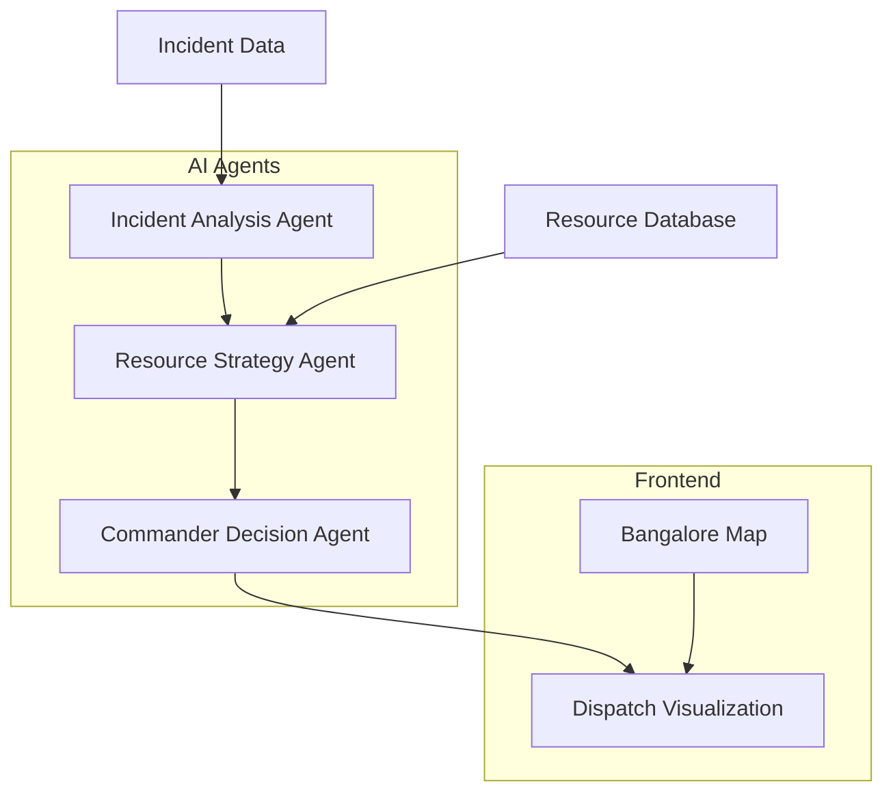

# AegisFlow
 
AegisFlow is a 24-hour hackathon MVP for a multi-agent AI disaster response and resource coordination system focused on Bangalore city. It presents a dark emergency command center dashboard where concurrent fire, flood, medical, and collapse incidents are analyzed by collaborating AI agents before a final dispatch decision is visualized on a live map.
 
## Architecture
 
- **Frontend:** React + Vite + Tailwind CSS + Leaflet/OpenStreetMap
- **Backend:** Python FastAPI
- **AI:** Groq OpenAI-compatible API using `llama-3.3-70b-versatile`
- **Database:** SQLite seeded with realistic Bangalore incidents and resources
 
Agent flow:
 
1. Incident Analysis Agent evaluates severity, civilian impact, and risk zones.
2. Resource Strategy Agent maps available ambulances, fire trucks, and rescue teams to incidents.
3. Commander Decision Agent reviews the previous outputs and authorizes final dispatch decisions.
 
Each agent has a separate prompt and exchanges structured JSON with the next step.
 
## Project Structure
 
```text
backend/
  agents.py
  data.py
  database.py
  .env.example
  groq_client.py
  main.py
  requirements.txt
frontend/
  .env.example
  src/
    App.jsx
    api.js
    main.jsx
    styles.css
  package.json
  tailwind.config.js
  vite.config.js
start-backend.ps1
start-frontend.ps1
README.md
```
 
## Quick Start With Docker (Recommended)
 
Prerequisite: install [Docker Desktop](https://www.docker.com/products/docker-desktop/).
 
From the project root:
 
```powershell
copy backend\.env.example backend\.env
# edit backend\.env and set GROQ_API_KEY
# 🚨 AegisFlow: Multi-Agent AI Disaster Response System
 
[](https://opensource.org/licenses/MIT)
[](https://www.python.org/downloads/)
[](https://reactjs.org/)
[](https://aegisflow-frontend.onrender.com)
 
> **🏆 Hackathon Project** | Real-time AI-powered emergency coordination for Bangalore city
 
AegisFlow is a sophisticated multi-agent AI system that coordinates disaster response across Bangalore. Watch three specialized AI agents collaborate in real-time to analyze incidents, allocate resources, and make life-saving dispatch decisions on an interactive command center dashboard.
 
---
 
## ✨ Key Features
 
### 🤖 Multi-Agent AI Architecture
- **Incident Analysis Agent**: Evaluates severity, civilian impact, and risk zones
- **Resource Strategy Agent**: Optimizes allocation of ambulances, fire trucks, rescue teams
- **Commander Decision Agent**: Authorizes final dispatch decisions based on agent inputs
 
### 🗺️ Real-Time Visualization
- Interactive Bangalore map with live incident tracking
- Real-time resource dispatch routes and allocation
- Dark emergency command center interface
- Animated agent reasoning and decision flow
 
### 🚀 Advanced Technology Stack
- **Frontend**: React + Vite + Tailwind CSS + Leaflet Maps
- **Backend**: Python FastAPI with async processing
- **AI**: Groq Llama-3.3-70B model via OpenAI-compatible API
- **Database**: SQLite with realistic Bangalore incident data
 
---
 
## 🎯 Demo Experience
 
1. **Launch Dashboard**: Dark emergency command center interface
2. **Incident Detection**: 4 concurrent disasters across Bangalore (fire, flood, medical, collapse)
3. **AI Analysis**: Watch agents analyze incidents in real-time
4. **Resource Coordination**: Dynamic allocation of emergency services
5. **Dispatch Visualization**: Live routes and resource deployment on map
 
---
 
## 🚀 Quick Start
 
### Option 1: Docker (Recommended)
 
```bash
# Clone the repository
git clone https://github.com/Vignesh942/AegisFlow-Multi-Agent-Disaster-Response-System.git
cd AegisFlow-Multi-Agent-Disaster-Response-System
 
# Setup environment
cp backend/.env.example backend/.env
# Edit backend/.env and add your GROQ_API_KEY
 
# Launch the system
docker compose up --build
1 hidden line
 
Then open `http://localhost:5173`.
 
Useful commands:
 
```powershell
docker compose down
docker compose up -d
docker compose logs -f
```
 
## Quick Start (Windows PowerShell, No Docker)
 
Open two terminals at the project root:
 
Terminal 1 (backend):
 
```powershell
.\start-backend.ps1
```
 
Terminal 2 (frontend):
 
```powershell
.\start-frontend.ps1
```
 
Open `http://localhost:5173`.
 
If PowerShell blocks scripts, use:
 
```cmd
start-backend.cmd
start-frontend.cmd
```
 
## Backend Setup
 
```powershell
Open [http://localhost:5173](http://localhost:5173) to access the dashboard.
 
### Option 2: Manual Setup
 
**Backend Setup:**
```bash
cd backend
2 hidden lines
pip install -r requirements.txt
copy .env.example .env
python -m uvicorn main:app --reload
```
 
The API runs at `http://localhost:8000`.
 
Endpoints:
 
- `GET /incidents`
- `GET /resources`
- `POST /analyze`
- `POST /allocate`
 
## Groq API Setup
 
Create `backend/.env` or set the environment variable:
 
```bash
GROQ_API_KEY=your_groq_api_key_here
```
 
The backend calls:
 
- URL: `https://api.groq.com/openai/v1/chat/completions`
- Model: `llama-3.3-70b-versatile`
 
If no key is configured, AegisFlow uses deterministic fallback decisions so the dashboard remains demo-ready.
 
## Frontend Setup
 
```powershell
cp .env.example .env
# Edit .env with your GROQ_API_KEY
uvicorn main:app --reload
```
 
**Frontend Setup:**
```bash
cd frontend
3 hidden lines
 
Open `http://localhost:5173`.
 
## Demo Flow
 
1. Start FastAPI.
2. Start Vite.
3. Open the dashboard.
4. Click **Run agent dispatch**.
5. Watch incidents, resource markers, dispatch lines, agent reasoning, and commander decisions update together.
 
## Screenshots
 
Add screenshots here after running the app:
 
- Dashboard overview
- Bangalore incident map
- AI command chain reasoning
- Final dispatch decision
Access the dashboard at [http://localhost:5173](http://localhost:5173).
 
---
 
## 🔧 Configuration
 
### Required Environment Variables
 
Create `backend/.env` with:
```bash
GROQ_API_KEY=your_groq_api_key_here
```
 
**Get your free API key at [Groq Console](https://console.groq.com/)**
 
### API Endpoints
 
- `GET /incidents` - Retrieve current disaster incidents
- `GET /resources` - Get available emergency resources
- `POST /analyze` - Run multi-agent incident analysis
- `POST /allocate` - Execute resource allocation strategy
 
---
 
## 🏗️ Architecture
 

 
---
 
## 🌟 Innovation Highlights
 
### 🧠 Intelligent Decision Making
- **Contextual Analysis**: Each agent uses specialized prompts for domain expertise
- **Structured Communication**: Agents exchange JSON-structured insights
- **Fallback Logic**: System works with or without AI API access
 
### 📊 Real-Time Coordination
- **Geospatial Intelligence**: Distance-based resource scoring
- **Priority Management**: Severity-weighted incident handling
- **Dynamic Routing**: Visual dispatch paths on interactive map
 
### 🛡️ Production Ready
- **Error Handling**: Graceful degradation and timeout management
- **Scalable Architecture**: Async processing and modular design
- **Security**: Environment-based configuration, no hardcoded secrets
 
---
 
## 🎮 Live Demo
 
**🌐 [Try the Live Demo](https://aegisflow-frontend.onrender.com)**
 
*Experience the full multi-agent coordination system in action*
 
---
 
## 📁 Project Structure
 
```
AegisFlow/
├── backend/
│   ├── agents.py          # Multi-agent AI logic
│   ├── database.py        # SQLite data management
│   ├── main.py           # FastAPI application
│   └── groq_client.py    # AI API integration
├── frontend/
│   ├── src/
│   │   ├── App.jsx       # Main dashboard
│   │   ├── CommandMap.jsx # Interactive map
│   │   └── Panels.jsx    # Agent reasoning displays
│   └── package.json
├── docker-compose.yml    # Container orchestration
└── DEPLOYMENT.md         # Hosting instructions
```
 
---
 
## 🚀 Deployment
 
### Free Hosting Options
 
1. **Render.com** (Recommended)
   - Backend: Python web service
   - Frontend: Static site
   - Free tier with custom domains
 
2. **Vercel + Railway**
   - Frontend on Vercel
   - Backend on Railway
 
3. **Netlify + PythonAnywhere**
   - Static frontend + Python backend
 
**📖 [Complete Deployment Guide](./DEPLOYMENT.md)**
 
---
 

 
### Problem Solved
- **Emergency Response Coordination**: Critical need in disaster management
- **Resource Optimization**: Efficient allocation of limited emergency services
- **Real-Time Decision Making**: AI-assisted rapid response planning
 
### Technical Innovation
- **Multi-Agent Systems**: Advanced AI architecture
- **Geospatial Intelligence**: Location-aware resource management
- **Real-Time Visualization**: Interactive emergency command center
 
### Social Impact
- **Life-Saving Potential**: Faster, more coordinated emergency response
- **Scalable Solution**: Adaptable to any city or disaster type
- **Accessibility**: Web-based platform for emergency managers
 
---
 
## 🤝 Contributing
 
1. Fork the repository
2. Create your feature branch (`git checkout -b feature/amazing-feature`)
3. Commit your changes (`git commit -m 'Add amazing feature'`)
4. Push to the branch (`git push origin feature/amazing-feature`)
5. Open a Pull Request
 
---
 
## 📄 License
 
This project is licensed under the MIT License - see the [LICENSE](LICENSE) file for details.
 
---
 
## 🙏 Acknowledgments
 
- **Groq** for providing the powerful Llama-3.3-70B model API
- **OpenStreetMap** for Bangalore mapping data
- **React & FastAPI** communities for excellent frameworks
 
---
 
## 📞 Contact
 
**Created by**: [Vignesh942](https://github.com/Vignesh942)
 
**Project Link**: [https://github.com/Vignesh942/AegisFlow-Multi-Agent-Disaster-Response-System](https://github.com/Vignesh942/AegisFlow-Multi-Agent-Disaster-Response-System)
 
---
 
